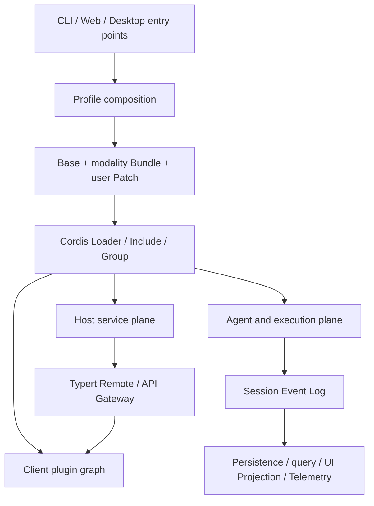

# WorldlineBox Architecture

English | [中文](architecture.zh.md)

Worldline is a composable Agent Harness built on Cordis. Agent Loop is the default implementation, not an irreplaceable kernel. LLMs, tools, sessions, persistence, sandboxes, UI, desktop bridges, and external agents are composed through services and plugin trees.

## Runtime layers



### Application entry points

- `apps/cli` parses invocation modes, loads Profiles, mounts the Cordis tree, and owns process exit.
- `apps/web` is the browser build entry and owns no Host privileges.
- `apps/desktop` owns Electron lifecycle and the window shell; the Web Profile still supplies the product runtime.

Entry points must not directly implement Agent, database, tool, or filesystem behavior. A new runtime modality should compose existing plugins and add entry-point code only when it has genuinely new process responsibilities.

## Core spine

| Service | Owner | Responsibility |
| --- | --- | --- |
| `ctx.sessions` | `core/session` | Append-only Session Event Log and in-memory Session store |
| `ctx.systemPrompt` | `core/system-prompt` | Prompt section and tool-schema composition |
| `ctx.tools` | `core/tools` | Layered tool registration, policy events, and canonical execution results |
| `ctx.agents` | `core/agent` | Agent interface, live-instance registry, and initiator scope |
| `ctx.agentLoop` | `core/agent-loop` | Default Turn/Step driver |
| `ctx.llm` | `llm/llm` | LLM Provider registration, model resolution, and streaming vocabulary |
| `ctx.invariants` | `runtime-diagnostics/invariants` | Package-level runtime relationship registry |

These services form the product API spine. Extensions should observe their events or register contributions. Change a spine package only when the fundamental semantics of every Agent must change.

## Four planes

### Composition plane

Profiles, Bundles, and Patches select plugins, Providers, and policies. The composition plane owns implementation selection, not implementation logic.

### Host plane

The Host owns operating-system and secret-bearing privileges: filesystems, subprocesses, PTYs, sandboxes, credentials, persistence, HTTP, the desktop browser, and the Workspace Tree. Host services release resources through the Cordis lifecycle.

### Agent plane

Each Agent reads its merged Prompt, Tools, Skills, and policies from an isolated scope. Agent Presets select session capabilities while process-level registries remain Host-owned.

### Client plane

Client Runtime creates Session scopes, state projections, and the Slot Registry in the browser. UI packages contribute slots, locales, and interactions; they do not access Node APIs directly.

## Data ownership

<a id="events"></a>

<a id="turn-flow"></a>

See [capability seams](capability-seams.md) and the [Session and Turn lifecycle](session-turn-lifecycle.md) for event semantics and Turn timing.

- The Session Event Log is the sole source of truth for model history and session facts.
- Projections are rebuildable derived state and cannot become reverse sources of truth.
- Settings and Credentials are stored separately; settings contain credential references only.
- Workspace is a business entity; Workspace Tree is a Host filesystem-browsing capability. They must not be merged into an omniscient service.
- The Loader tree is the source of truth for plugin lifecycle; Plugin Center stores only user overlays and does not copy Loader state.

## Dependency direction

```text
Application entry -> Bundle/composition -> Provider + Consumer -> Service Definition -> Cordis
Client UI -> Client Runtime/Remote Types -> API Remote -> Host Service
```

Forbidden directions include Service Definition importing a Provider, Agent Loop importing a concrete tool, Client importing a Host implementation, and the desktop entry point implementing product behavior.
