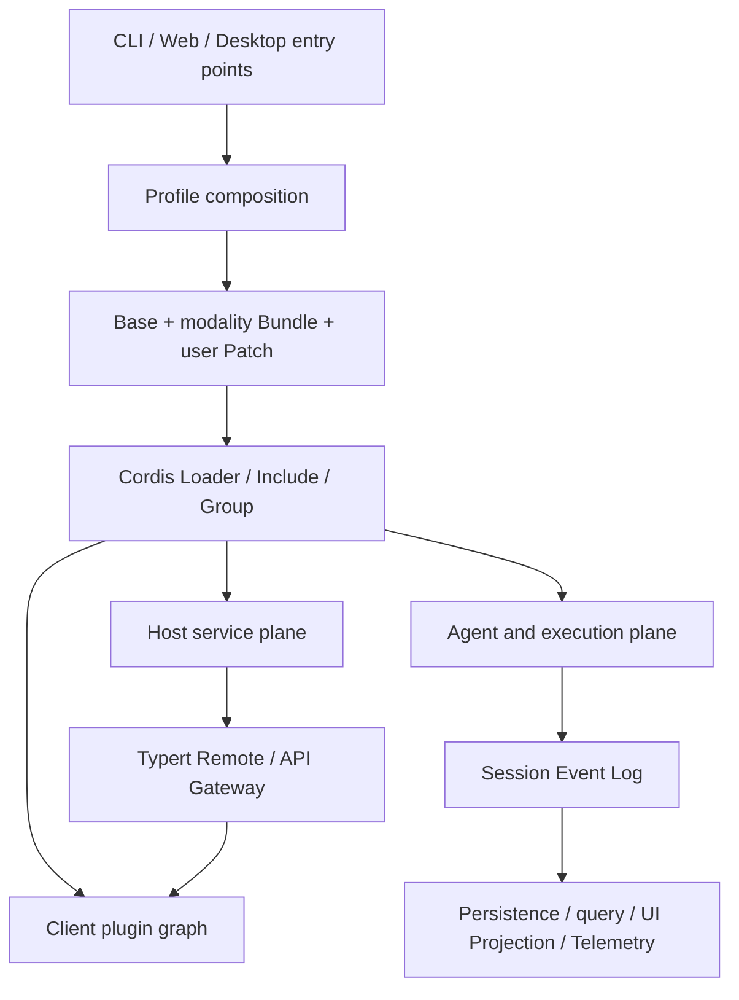

# 世界线 Harness 总体架构

[English](architecture.md) | 中文

世界线是基于 Cordis 的可组合 Agent Harness。Agent Loop 是默认实现而不是不可替换内核；LLM、工具、Session、持久化、沙箱、UI、桌面桥接和外部 Agent 都通过服务与插件树组合。

## 运行时分层



### 应用入口

- `apps/cli` 解析调用方式、加载 Profile、挂载 Cordis 树并负责退出。
- `apps/web` 是浏览器构建入口，不持有 Host 权限。
- `apps/desktop` 是 Electron 生命周期和窗口壳；业务运行时仍由 Web Profile 提供。

入口不得直接实现 Agent、数据库、工具或文件业务。新的运行形态应组合现有插件，只在确有新进程职责时增加入口代码。

## 核心脊柱

| 服务 | 所有者 | 职责 |
| --- | --- | --- |
| `ctx.sessions` | `core/session` | 追加式 Session Event Log 与内存 Session 存储 |
| `ctx.systemPrompt` | `core/system-prompt` | Prompt section 和工具 schema 组合 |
| `ctx.tools` | `core/tools` | 分层工具注册、策略事件和规范化执行结果 |
| `ctx.agents` | `core/agent` | Agent 接口、存活实例注册和 initiator scope |
| `ctx.agentLoop` | `core/agent-loop` | 默认 Turn/Step 驱动器 |
| `ctx.llm` | `llm/llm` | LLM Provider 注册、模型解析和流式响应词汇 |
| `ctx.invariants` | `runtime-diagnostics/invariants` | 包级运行时关系验证注册表 |

这些服务构成产品 API 脊柱。扩展功能应监听其事件或注册贡献；只有改变所有 Agent 的基本语义时才修改脊柱包。

## 四个平面

### 组合平面

Profile、Bundle 和 Patch 决定加载哪些插件、Provider 和策略。组合平面拥有实现选择，但不拥有实现逻辑。

### Host 平面

Host 持有操作系统与机密权限：文件系统、子进程、PTY、沙箱、凭据、持久化、HTTP、桌面浏览器和 Workspace Tree。Host 服务通过 Cordis 生命周期释放资源。

### Agent 平面

每个 Agent 在独立 scope 中读取合并后的 Prompt、Tools、Skills 和策略。Agent Preset 决定会话级能力，而进程级注册表仍由 Host 所有。

### Client 平面

Client Runtime 在浏览器内创建 Session scope、状态投影和 Slot Registry。UI 包只贡献 slot、locale 和交互，不直接访问 Node API。

## 数据所有权

<a id="events"></a>

<a id="turn-flow"></a>

具体的事件语义与 Turn 时序分别见[能力接缝](capability-seams.md)和 [Session 与 Turn 生命周期](session-turn-lifecycle.md)。

- Session Event Log 是模型历史和会话事实的唯一真源。
- Projection 是可重建派生状态，不能反向成为事实来源。
- Settings 和 Credentials 分开存储；设置只保存凭据引用。
- Workspace 是业务实体；Workspace Tree 是 Host 文件浏览能力；两者不能合并为一个全知服务。
- Loader tree 是插件生命周期真源；插件中心只保存用户 overlay，不复制 Loader 状态。

## 依赖方向

```text
Application entry -> Bundle/composition -> Provider + Consumer -> Service Definition -> Cordis
Client UI -> Client Runtime/Remote Types -> API Remote -> Host Service
```

禁止的方向包括：Service Definition 导入 Provider、Agent Loop 导入具体工具、Client 导入 Host 实现、桌面入口实现产品业务。
